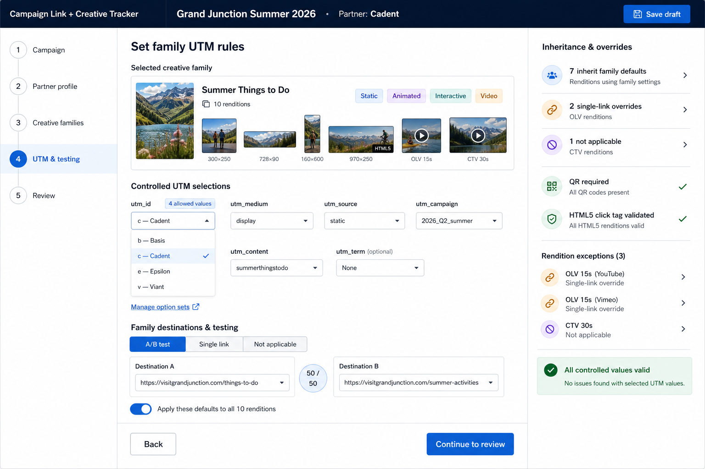
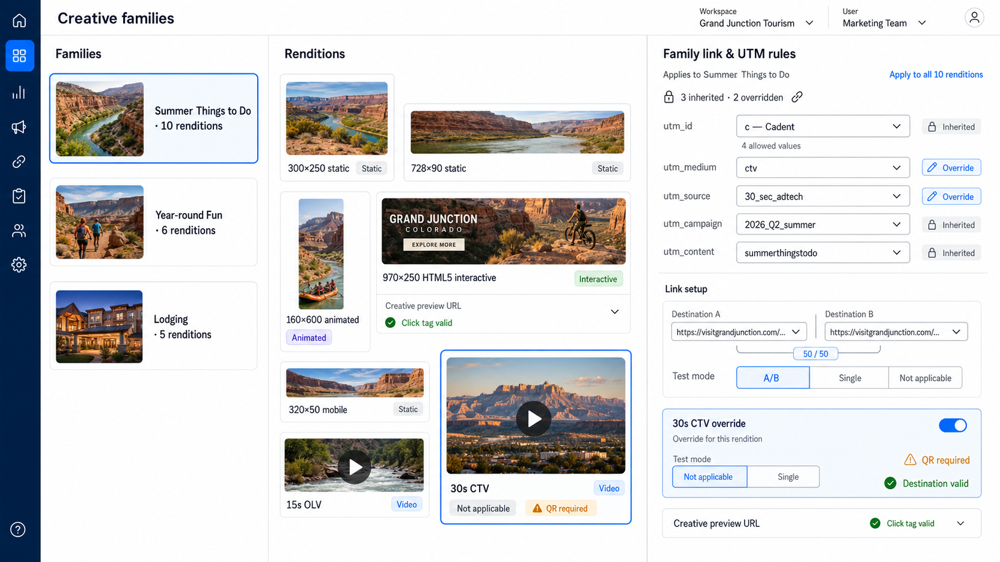
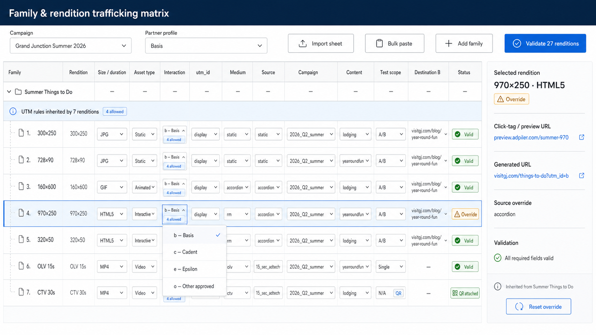
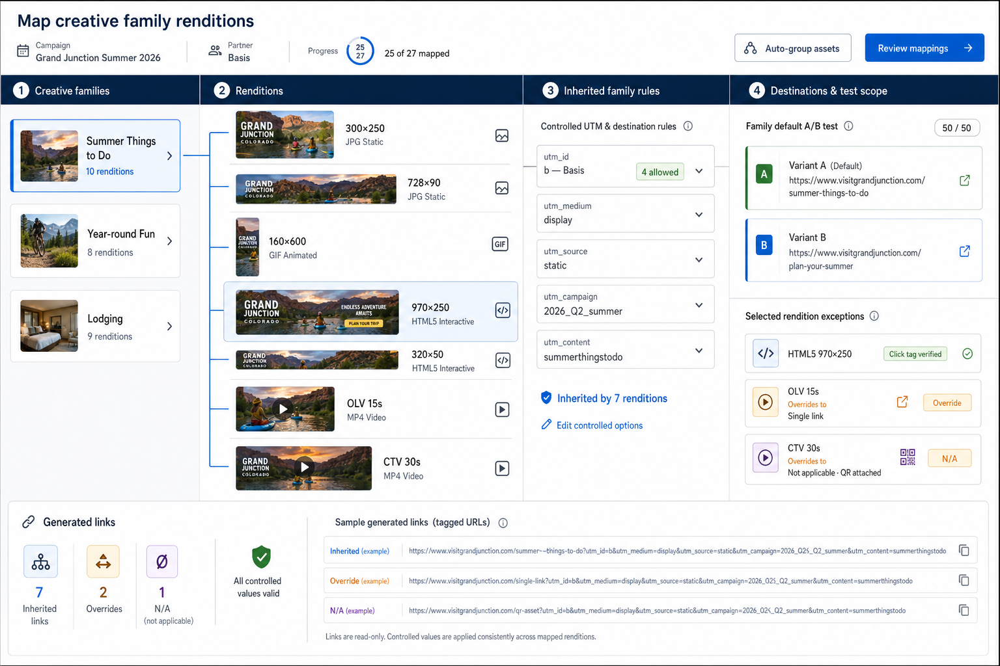
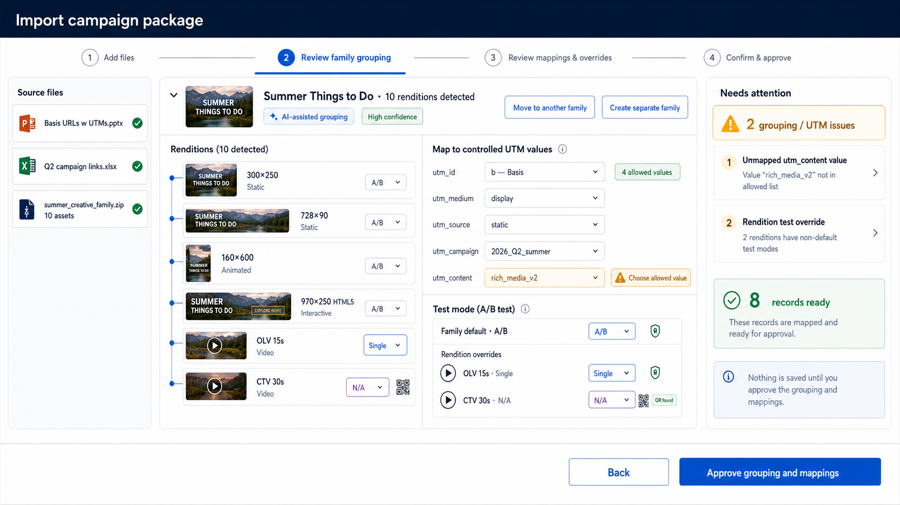
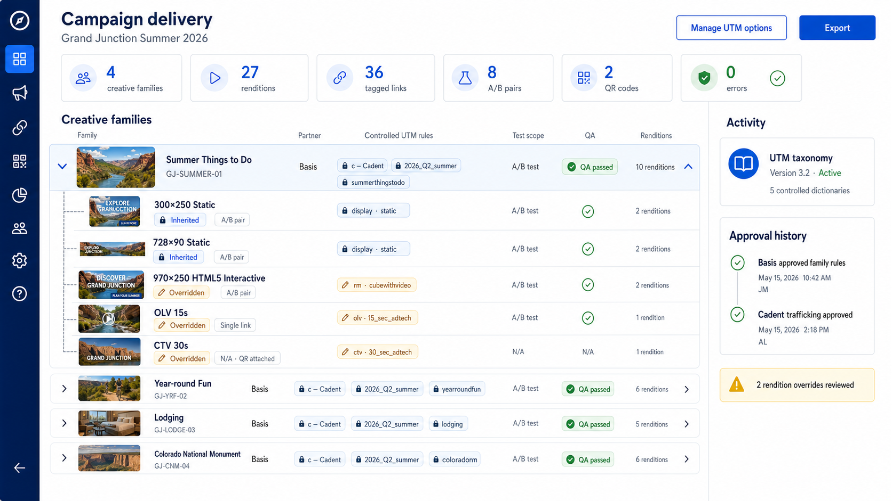
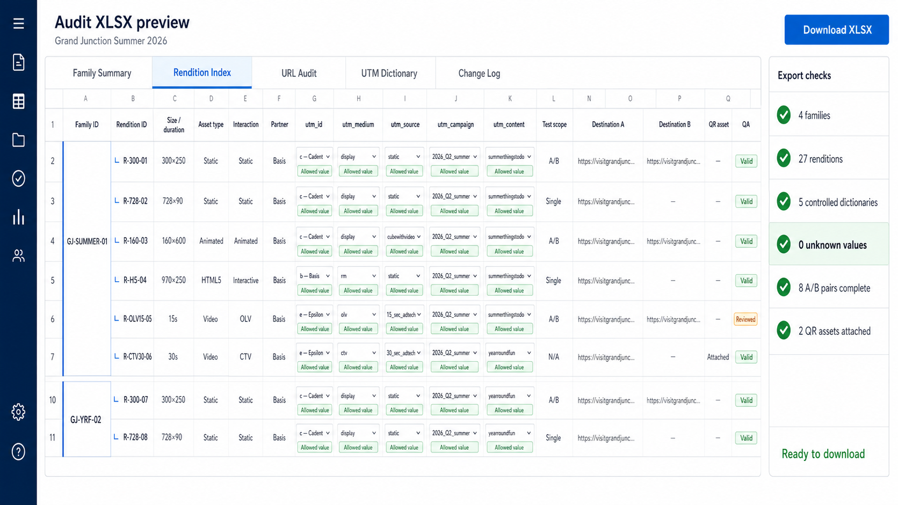
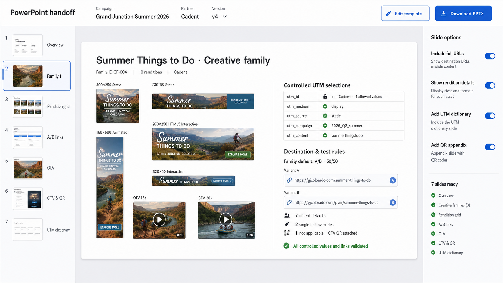
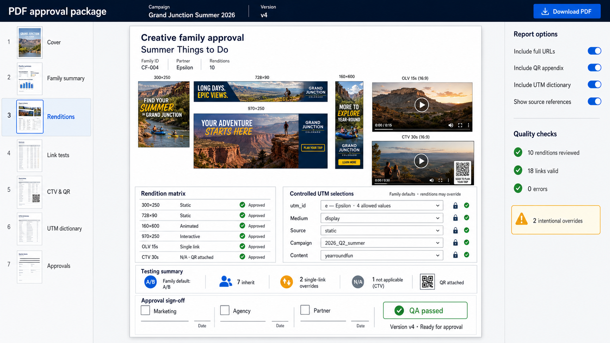
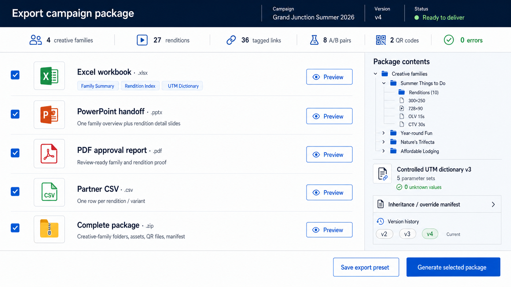

# Campaign Link + Creative Tracker — revised concepts

This v2 gallery incorporates two requirements:

1. UTM values come from controlled option sets and appear as dropdowns rather than unrestricted text fields.
2. A creative can be a family containing many renditions: different dimensions, durations, file types, and interaction models.

No application functionality is implemented in this folder.

## Recommended data model

### Controlled UTM dictionary

Each parameter has an administered list of allowed values, labels, optional descriptions, defaults, and availability rules. For example, `utm_id` can expose four approved values while `utm_medium`, `utm_source`, `utm_campaign`, `utm_content`, and `utm_term` use their own dropdown dictionaries.

Campaign and partner profiles can narrow the options. A value that is not in the dictionary should be flagged for mapping rather than silently accepted. New values should be added through a controlled settings surface, not typed ad hoc inside a campaign row.

### Creative family and renditions

- **Creative family:** the shared concept, message, destination strategy, default UTM selections, and default testing rule.
- **Rendition:** one deliverable execution, such as 300×250 JPG, 728×90 JPG, 160×600 animated GIF, 970×250 HTML5 interactive, 15-second OLV, or 30-second CTV.
- **Inheritance:** renditions inherit the family defaults so ten sizes do not require ten separately maintained records.
- **Overrides:** a rendition can override destination, controlled UTM selection, test mode, or other behavior when necessary.
- **Format-specific validation:** interactive renditions can require a preview URL and validated click tag; video can require duration and media metadata; CTV can require a QR asset and default to A/B not applicable.

If an interactive execution preserves the same concept and measurement intent, it can remain a rendition in the family. If it has materially different content, interaction goals, or destinations, it should become its own family.

## Revised input concepts

### 1. Guided wizard

Family defaults are selected from controlled dropdowns, then inherited or overridden by individual renditions.

### 2. Creative-first library

Starts with creative families, exposes the rendition gallery, and manages shared link/UTM rules from the selected family.

### 3. Bulk matrix

An expert view with families grouping child rendition rows and dropdown controls inside the trafficking grid.

### 4. Linkage workspace

Shows the hierarchy from family to renditions to inherited rules to destinations and test scope.

### 5. Smart import and grouping review

Groups uploaded assets into families, detects rendition properties, and requires the user to map imported UTM values to the controlled dictionary.

## Revised output concepts

### 1. Live operations dashboard

Groups campaign status by family with expandable rendition details, inheritance, overrides, and QA.

### 2. Excel workbook preview

Adds Family Summary, Rendition Index, UTM Dictionary, and URL Audit views so each deliverable remains independently trafficable.

### 3. PowerPoint handoff

Uses one family overview with a visual rendition montage and clean testing/UTM summaries instead of repeating raw URLs across many slides.

### 4. PDF approval report

Provides a print-friendly family, rendition, controlled-UTM, testing, QR, and sign-off summary.

### 5. Multi-format delivery hub

Packages family folders, rendition assets, manifests, QR files, the controlled UTM dictionary, and generated Excel/PowerPoint/PDF/CSV outputs from one campaign version.

