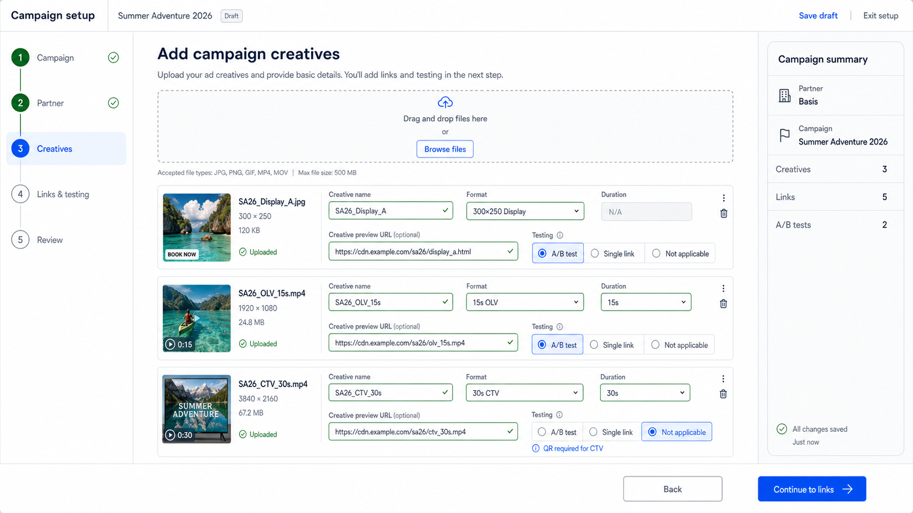
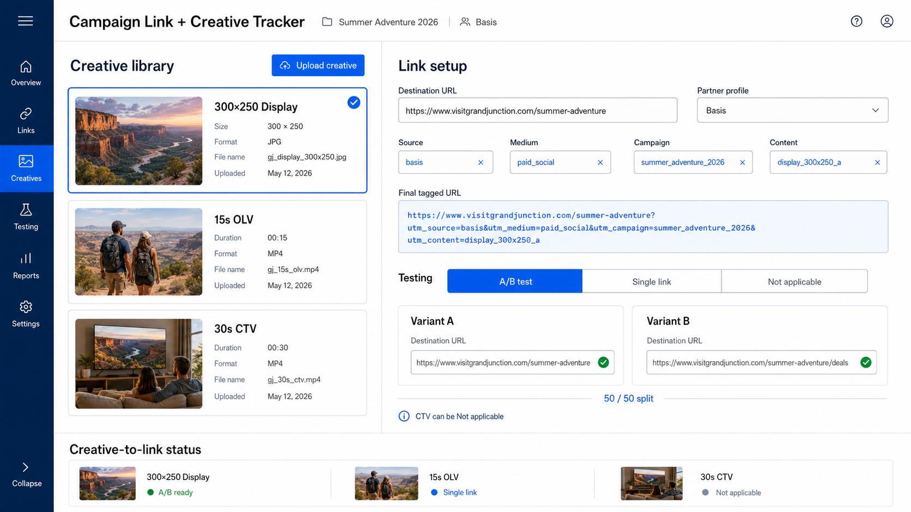
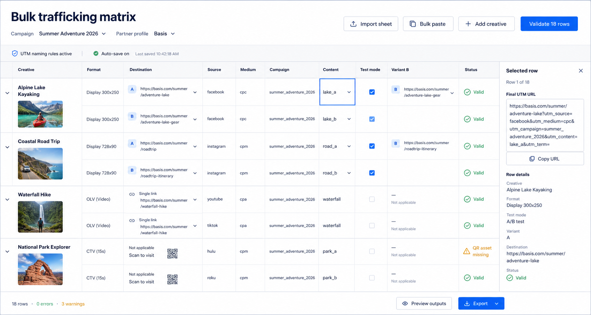
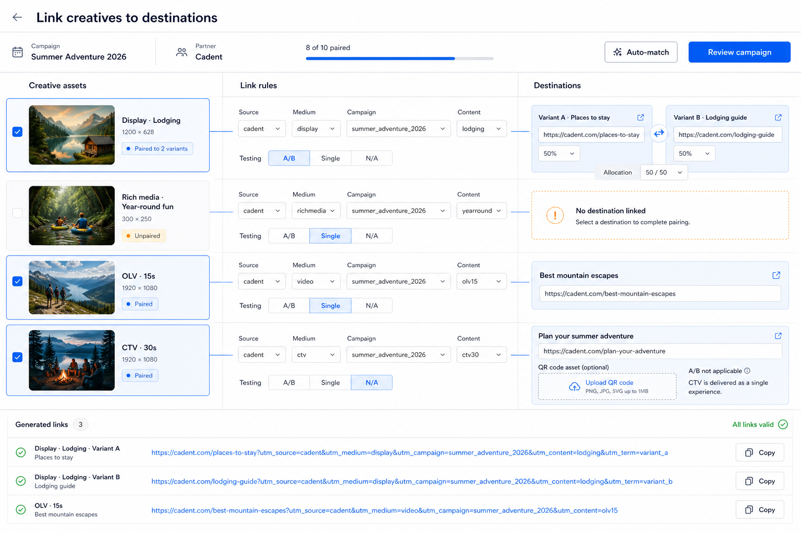
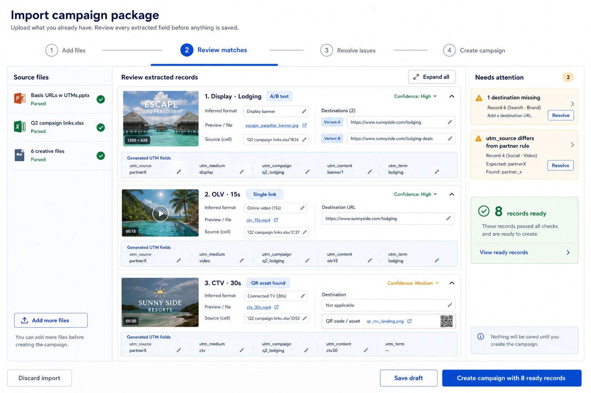
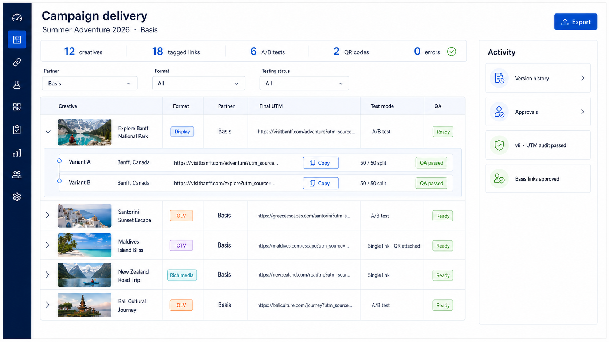
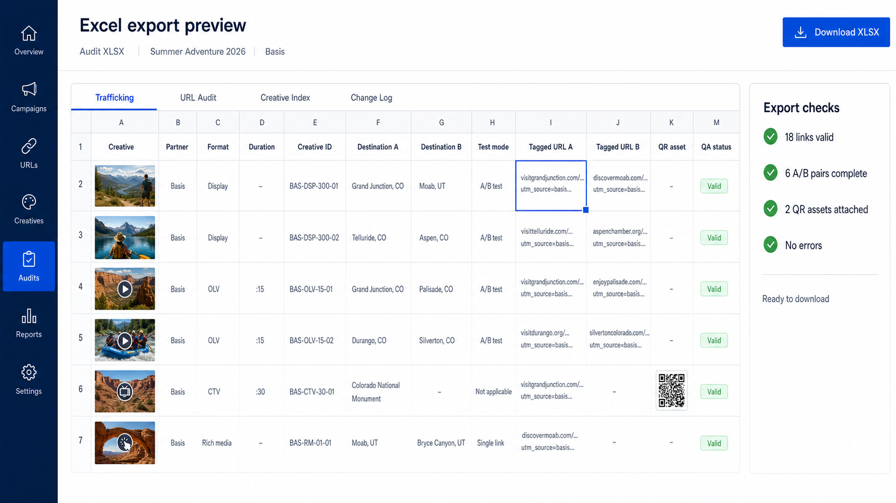
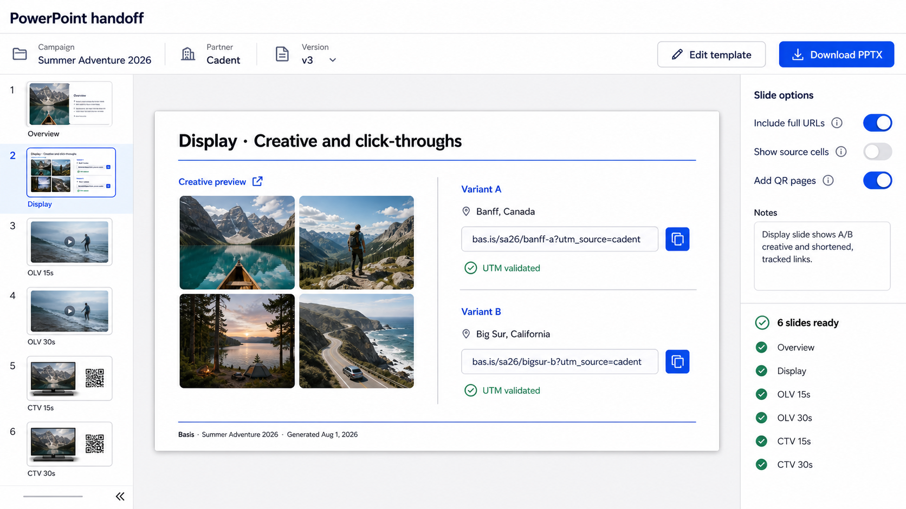
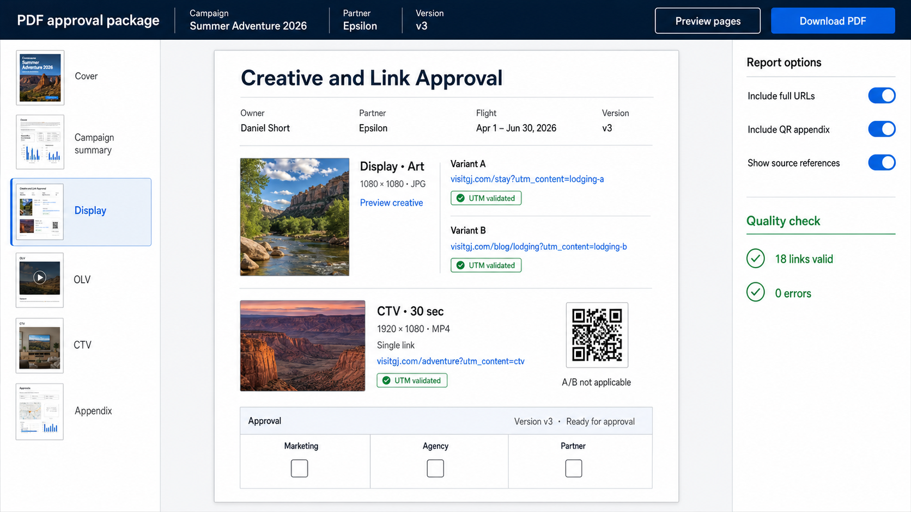
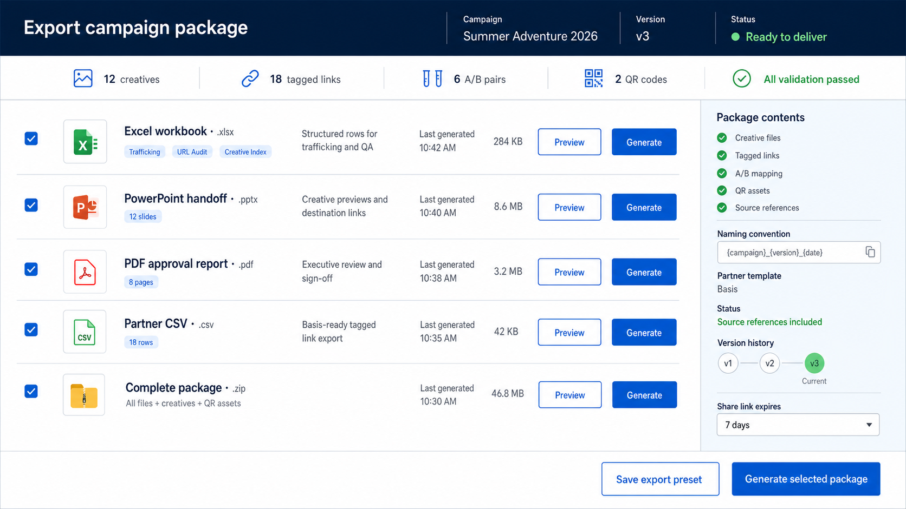

# Campaign Link + Creative Tracker — concept gallery

These concepts explore how the existing UTM Batch Builder could grow into a creative-aware adtech campaign tracker without implementing the feature yet.

## What the reference decks imply

- Every record needs a partner/vendor, format, duration or size, creative asset or preview URL, destination URL, structured UTM fields, and source reference.
- A/B testing must be an item-level choice with three explicit states: **A/B test**, **Single link**, and **Not applicable**.
- The current examples generally use A/B for Display and rich media, while OLV and CTV use a single destination. CTV also needs a QR asset.
- Spreadsheet cell references are useful provenance, but the tracker should also assign stable campaign, creative, and link IDs.
- The canonical data should live in the tracker. Excel, PowerPoint, PDF, CSV, and ZIP packages should be generated views rather than separately maintained sources.

## Five input directions

### 1. Guided wizard

Best for a clean default workflow. It prevents omissions and makes CTV/test eligibility explicit, but adds more clicks for expert users.

### 2. Creative-first library

Best when the creative asset is the natural starting point. It makes the asset-to-destination relationship concrete and keeps variants attached to the correct creative.

### 3. Bulk trafficking matrix

Best for large campaigns and spreadsheet-oriented operators. It is fast and auditable, but should be an optional expert mode rather than the first screen.

### 4. Linkage workspace

Best for understanding relationships at a glance. It shows creative, UTM rules, destinations, test mode, and generated links in one aligned surface.

### 5. Smart import and review

Best bridge from the current process. PowerPoint, Excel, creative files, and pasted URLs can be parsed into records, but nothing is saved until the user reviews and approves it.

## Five output directions

### 1. Live operations dashboard

The canonical working view for filtering, validating, copying links, reviewing A/B pairs, and tracking changes.

### 2. Excel workbook preview

An operations-first export with dedicated Trafficking, URL Audit, Creative Index, and Change Log sheets.

### 3. PowerPoint handoff

A cleaner replacement for the current partner decks: creative visual, preview link, structured A/B destinations, QA status, and dedicated CTV/QR slides.

### 4. PDF approval report

A print-friendly approval artifact for marketers, agencies, and partners, with version metadata and sign-off fields.

### 5. Multi-format delivery hub

A single place to regenerate XLSX, PPTX, PDF, CSV, and a complete ZIP from the same campaign version.

## Recommended product direction

Use **Guided wizard** as the default shell, place the **Creative-first library / Linkage workspace** inside the creative-and-links steps, expose the **Bulk matrix** as expert mode, and add **Smart import** as an alternate starting path.

Use the **Live operations dashboard** as the source of truth. Make the **Multi-format delivery hub** its export action, with XLSX as the operational artifact, PowerPoint as the partner handoff, and PDF as the approval record.

The core record should include:

- Campaign and partner profile
- Creative asset ID, filename, preview URL, format, size or duration, and version
- Placement/channel and source provenance
- Test mode: `ab`, `single`, or `not_applicable`
- Variant A and optional Variant B destination records
- Structured UTM fields and generated URLs
- Optional QR asset and QR destination
- Validation, owner, notes, approval, and change history

